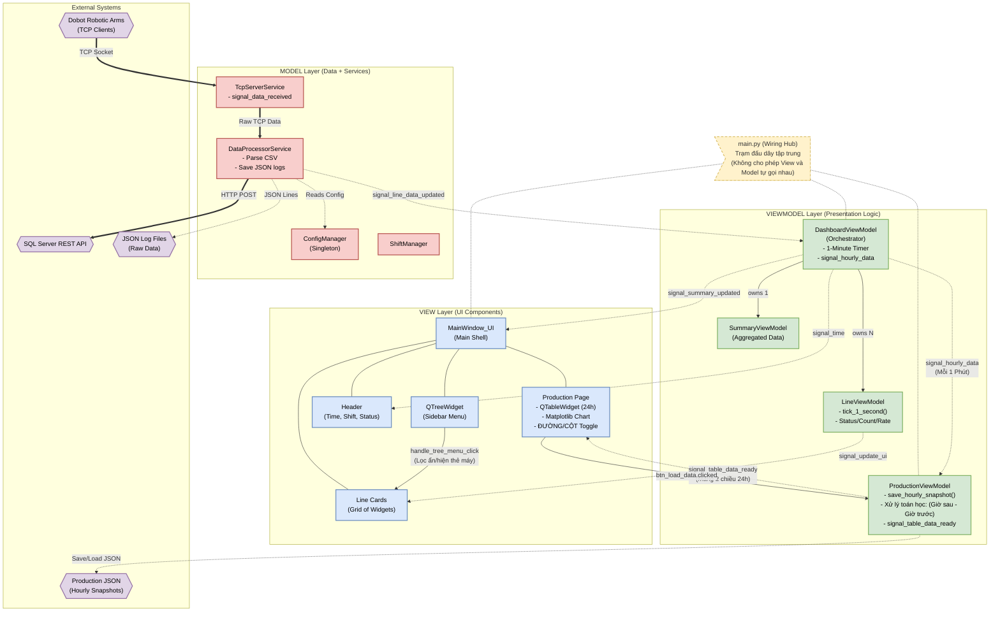

# Factory Monitor Dashboard - Architecture v2

Dưới đây là sơ đồ kiến trúc MVVM tổng thể của ứng dụng, được cập nhật sau quá trình tích hợp module Production, Biểu đồ và xử lý dữ liệu Realtime.

## Ghi chú các Mũi tên (Legend)
- **Nét đứt (-.->)**: Data Binding (Signal/Slot) - Dữ liệu truyền từ dưới lên trên.
- **Nét liền mỏng (--->)**: Commands - Lệnh điều khiển từ trên xuống dưới.
- **Nét liền kép (===>)**: External / Internal Data Flow - Luồng dữ liệu hệ thống vật lý.
- **Box Màu vàng nhạt**: Các File/Class không thuộc Layer cụ thể nhưng đóng vai trò quản lý chéo (Ví dụ: `main.py`).

## Các phần đã bổ sung so với v1:
1. Thêm cụm **Production Page (v5)** và **ProductionViewModel (vm4)**.
2. Thể hiện cơ chế 1-Minute Timer và phép trừ Data (`Giờ sau - Giờ trước`).
3. Làm rõ luồng truyền Mảng 2 chiều (`table_rows`) thẳng từ ViewModel sang View để bảo vệ kiến trúc MVVM.
4. Thêm node quản lý file JSON Production riêng biệt.
5. Thể hiện trạm đấu dây `main.py` ở trung tâm.
